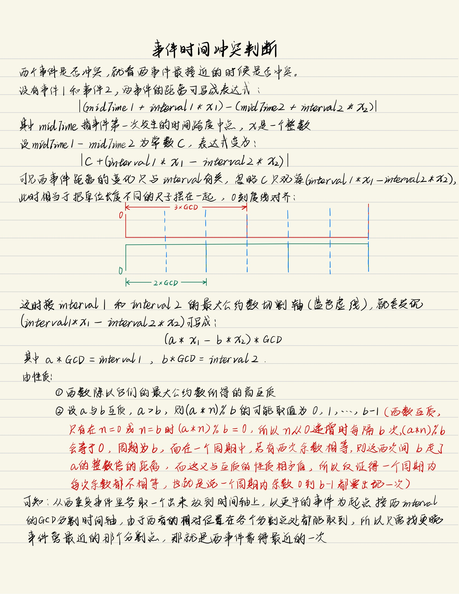

# Perfect项目开发


## 项目标准

**App图标**

trip_origin

**用色**

主题紫：`#7C4DFF`

浅色蓝灰背景：`#F2F2F6`

深色蓝灰背景：`#1C1C1D`

**资源ID命名**

R.anim：`slide_out_bottom`、`fade_in`

R.dimen：`notification_large_icon_height`

R.layout：`dialog_dhm_picker`、`activity_main`、`dialog_sign_in`

R.string：`fingerprint_icon_content_description`、`event_dialog_title`、`event_dialog_content`

R.style：`Animation_FocusActivity`、`TextAppearance.Perfect.Button`

R.styleable：`ProgressBar_backgroundTint`

R.raw：`remind_sound`

**控件ID命名**

`模块_逻辑_控件缩写`如`focus_exit_btn`，然后在Java代码中，控件对象命名为：`exitBtn`

控件缩写：

+ Button：btn
+ TextView：tv
+ EditText：et
+ ImageView：iv
+ CircularProgressView：cpv
+ CardView：card
+ ScrollView：sv
+ WheelPicker：wp
+ CountableRadioButton：crbtn
+ ViewPager：pager
+ FloatingActionButton：fab
+ RecyclerView：rv

**文字样式**

App中所有文字样式都在styles.xml中通过textAppearance控制

**代码注释规则**

+ 只用单行注释和文档注释，不用多行注释
+ 对工具类的方法尽量全部加上文档注释
+ 难懂、重要的代码上方添加单行注释

**代码格式**

+ 所有代码均要采用Ctrl+Alt+L格式化
+ 一行代码不能超过100列

**颜色**

所有颜色值在colors.xml中指定

目前项目中用到的颜色属性：

`?attr/colorBackgroundFloating`：对话框背景、卡片背景

`?attr/colorHomepageBackground`：主页ViewPager背景

`?attr/colorPrimary`：部分按钮文本、设置、滚轮选择器选中项

`?attr/colorSecondary`：与`?attr/colorPrimary`保持一致

`?attr/colorOnSecondary`：与FloatingActionButton的ripple相关

`?android:attr/colorBackgroundFloating`：与`?attr/colorBackgroundFloating`保持一致

`?android:attr/textColorPrimary`：主要文本（部分标题、滚轮选择器普通item）

`?android:attr/textColorSecondary`：次要文本（主页卡片中的content、对话框中的部分content）

`?android:attr/colorBackground`：状态栏颜色（MainActivity、FocusActivity除外，
MainActivity采用`?attr/colorBackgroundFloating`使得状态栏与主页顶部的ActionBar背景一致，
FocusActivity将`android:windowTranslucentStatus"`设为true使状态栏透明，与专注背景色一致）


## 项目开发记录

**事件时间冲突判断**



**FocusActivity粘性沉浸模式开发踩坑记录**

机型：HUAWEI Mate40 Pro

+ 首先贴出启用粘性沉浸模式的代码：

  ```java
  /**
   * 启用全屏模式(粘性沉浸模式)
   */
  private void hideSystemUI() {
      View decorView = getWindow().getDecorView();
      decorView.setSystemUiVisibility(
          View.SYSTEM_UI_FLAG_IMMERSIVE_STICKY
          | View.SYSTEM_UI_FLAG_LAYOUT_STABLE
          | View.SYSTEM_UI_FLAG_LAYOUT_HIDE_NAVIGATION
          | View.SYSTEM_UI_FLAG_LAYOUT_FULLSCREEN
          | View.SYSTEM_UI_FLAG_HIDE_NAVIGATION
          | View.SYSTEM_UI_FLAG_FULLSCREEN);
  }
  ```

+ **问题**：FocusActivity切出时View上下抖动

  **解决**：添加对刘海屏的支持：

  xml中：

  ```xml
  <!-- 支持刘海屏，始终让内容显示到刘海区域 -->
  <item name="android:windowLayoutInDisplayCutoutMode">shortEdges</item>
  ```

  也可在代码中：

  ```java
  if (Build.VERSION.SDK_INT >= 28) {
      WindowManager.LayoutParams params = getWindow().getAttributes();
      params.layoutInDisplayCutoutMode =
          WindowManager.LayoutParams.LAYOUT_IN_DISPLAY_CUTOUT_MODE_SHORT_EDGES;
      getWindow().setAttributes(params);
  }
  ```

+ **问题**：点Home键切出再进入，粘性沉浸模式被取消

  **解决**：原因是我在onCreate里启用粘性沉浸模式，正确做法应该是在onWindowFocusChanged中启用：

  ```java
  @Override
  public void onWindowFocusChanged(boolean hasFocus) {
      super.onWindowFocusChanged(hasFocus);
      if (hasFocus) {
          // 进入粘性沉浸模式
          hideSystemUI();
      }
  }
  ```

+ **问题**：横竖屏切换时，状态栏有时不隐藏

  **解决**：对window设置FLAG_FULLSCREEN标记：

  xml中：

  ```xml
  <item name="android:windowFullscreen">true</item>
  ```

  或用代码在onCreate里：

  ```java
  getWindow().addFlags(WindowManager.LayoutParams.FLAG_FULLSCREEN);
  ```

+ **问题：**竖屏切换到横屏时，导航栏不隐藏

  **解决**：原因未知，但在AndroidManifest.xml中对FocusActivity设置属性

  ```xml
  android:configChanges="orientation|screenSize"
  ```

  解决了问题，据网上帖子说设置该属性后，切到横屏时有关生命周期的方法的回调次数由2次变为1次

+ **问题**：设置了上面问题的`android:configChanges="orientation|screenSize"`之后，横屏布局文件无法在切到横屏时被加载

  **解决：**貌似是添加该属性后Activity在横竖屏切换时就不会销毁重建了，于是重写了Activity的onConfigurationChanged，自己完成横竖屏切换时Activity的重建操作

  ```java
  @Override
  public void onConfigurationChanged(@NonNull Configuration newConfig) {
      super.onConfigurationChanged(newConfig);
      // android:configChanges="orientation|screenSize"导致activity屏幕方向改变后，
      // activity不会销毁重建，所以必须主动地更新界面布局(用上layout-land)、重新设置各个控件
      setContentView(R.layout.activity_focus);
      // 获取并设置控件
      timeTv = findViewById(R.id.focus_time_tv);
      cpv = findViewById(R.id.focus_cpv);
      stateTv = findViewById(R.id.focus_state_tv);
      exitBtn = findViewById(R.id.focus_exit_btn);
      exitBtn.setOnClickListener(v -> exitFocus());
      ViewGroup layout = findViewById(R.id.focus_layout);
      // 为布局添加长按监听
      layout.setOnTouchListener(new View.OnTouchListener() {
          int mDownX;
          int mDownY;
          final int mTouchSlop = ViewConfiguration.get(FocusActivity.this).getScaledTouchSlop();
  
          @Override
          public boolean onTouch(View v, MotionEvent event) {
              switch (event.getAction()) {
                  case MotionEvent.ACTION_DOWN:
                      mHandler.removeCallbacks(mAlterDisplayModeRunnable);
                      mDownX = (int) event.getX();
                      mDownY = (int) event.getY();
                      mHandler.postDelayed(mAlterDisplayModeRunnable, 800);
                      break;
                  case MotionEvent.ACTION_MOVE:
                      if (Math.abs(mDownX - event.getX()) > mTouchSlop
                          || Math.abs(mDownY - event.getY()) > mTouchSlop) {
                          // 移动过远则不是长按
                          mHandler.removeCallbacks(mAlterDisplayModeRunnable);
                      }
                      break;
                  case MotionEvent.ACTION_UP:
                  case MotionEvent.ACTION_CANCEL:
                      mHandler.removeCallbacks(mAlterDisplayModeRunnable);
              }
              return false;
          }
      });
      //重置有必要的变量
      displayMode = SHOW_TIME_PROGRESS_STATE_EXIT;
      disallowAnim = false;
      isFirstUpdate = true;
  }
  ```

+ **问题**：状态栏、导航栏可能意外出现，影响美观

  **解决**：在xml中将状态栏、导航栏设为透明：

  ```xml
  <!-- 透明导航栏 -->
  <item name="android:windowTranslucentNavigation">true</item>
  <!-- 透明状态栏 -->
  <item name="android:windowTranslucentStatus">true</item>
  ```

**AlarmManager提醒不准时**

即便`setExactAndAllowWhileIdle`，红米、华为仍然会推迟AlarmManager定时任务

测试后发现以下情况定时任务完全准时，甚至分秒不差

+ 手机不处于省电模式且红米对应用设置“No Restriction”、华为手动管理应用启动并打开“Run in background”时
+ 手机不处于省电模式且连接电源时

**AlarmManager提醒不振动**

之前发现，锁屏时专注提醒能发声，但不能振动

查阅资料，熄屏状态要振动，需要在vibrate方法多传一个AudioAttributes对象

```java
// 创建AudioAttributes对象，设置USAGE_ALARM，传入vibrate方法
AudioAttributes vibrationAttrs = new AudioAttributes.Builder()
    .setUsage(AudioAttributes.USAGE_ALARM)
    .build();
Vibrator vibrator = (Vibrator) context.getSystemService(
    Context.VIBRATOR_SERVICE);
VibrationEffect vibe = VibrationEffect.createWaveform(
    RELAX_VIBRATION_FLASHLIGHT_TIMINGS, -1);
vibrator.vibrate(vibe, vibrationAttrs);
```

经测试，华为Mate40 Pro(API29)、红米K30 Pro 5G(API30)可以锁屏时振动

**自定义DialogFragment**

按API说法，应在onCreateDialog中设置Dialog样式，在onCreateView中inflate布局，在onViewCreated里设置view。但测试发现这么写并不好使，Dialog尺寸奇怪，因此目前只在onCreateDialog方法里完成上述所有操作，不过效果良好

**MediaPlayer释放资源**

MediaPlayer使用完后必须调用release释放资源

**优化设置**

使用SettingManager接口抽象出设置访问行为

## 常量

通知ID、requestCode如下：

**BedtimeAlarmService.java**

```java
private static final int ACTIVATE_ALARM_NOTIFICATION_ID = 80;
private static final int ALARM_NOTIFICATION_ID = 81;
private static final int AFTER_ALARM_NOTIFICATION_ID = 82;

private static final int ACTIVATE_ALARM_NOTIFICATION_REQUEST_CODE = 880;
private static final int ALARM_NOTIFICATION_REQUEST_CODE = 881;
private static final int AFTER_ALARM_NOTIFICATION_REQUEST_CODE = 882;

private static final int BEDTIME_ALARM_REQUEST_CODE = 8882;
```

**EventReminderReceiver.java**

```java
private static final int EVENT_NOTIFICATION_ID = 83;
private static final int EVENT_NOTIFICATION_REQUEST_CODE = 883;

private static final int EVENT_ALARM_REQUEST_CODE = 8881;
```

**FocusService.java**

```java
private static final int FOCUS_NOTIFICATION_ID = 84;
private static final int FOCUS_NOTIFICATION_REQUEST_CODE = 884;

private static final int FOCUS_ALARM_REQUEST_CODE = 8880;
```

# Perfect

